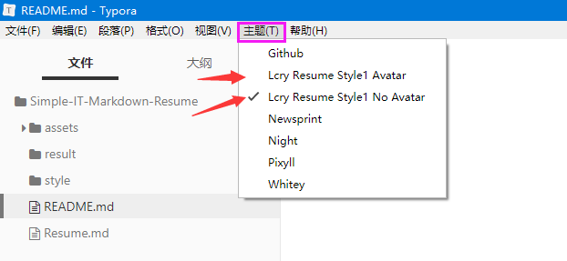

<div align="center">
    <h1>
        Simple-IT-Markdown-Resume
    </h1>
    <p align="center"> 一款适合 IT 行业的 Markdown 简约简历模版，拒绝花里胡哨 </p>
    
</div>


## 开始使用

（1）安装 Markdown 编辑软件，推荐使用 [Typora](https://www.typora.io/) 编辑器（免费版 Typora 百度网盘下载[点此下载](https://pan.baidu.com/s/1fZoAGxbT9L1oQdBz7akbjg?pwd=71d9)）。

（2）下载本项目，修改 [Resume.md](Resume.md) 文件即可。

（3）将 style 文件夹下的所有的.css 复制到 Typora 的主题文件夹


（4）主题文件夹可以在“文件-> 偏好设置-> 外观-> 主题文件夹“中打开。


（5）之后重启一下 Typora 编辑器，并在根据自己需求选择样式。

- Lcry Resume Style1 Avatar：带头像的简历样式
- Lcry Resume Style1 No Avatar：不带头像的简历样式




## 文件结构

```
└─Simple-IT-Markdown-Resume
    │  .gitignore                                 --git 忽略文件
    │  README.md                                  --Readme 文件
    │  Resume.md                                  --简历原始文件      
    ├─assets                                      --所有静态文件夹
    │  │  avatar.jpg               
    │  │  briefcase-solid.svg      
    │  │  envelope-solid.svg
    │  │  evaluate-solid.svg
    │  │  github-brands.svg
    │  │  graduation-cap-solid.svg
    │  │  honor-solid.svg
    │  │  info-circle-solid.svg
    │  │  info-solid.svg
    │  │  phone-solid.svg
    │  │  project-diagram-solid.svg
    │  │  rss-solid.svg
    │  │  tools-solid.svg
    │  │  
    │  └─img                                      --Readme 图片文件夹
    │          1.png
    │          2.png
    │          3.png
    │          main.jpg
    │          
    ├─result                                      --样式文件 PDF 效果图文件夹
    │      lcry-resume-style1-avatar.pdf      
    │      lcry-resume-style1-no-avatar.pdf
    │      
    └─style                                       --所有简历样式文件夹
            lcry-resume-style1-avatar.css
            lcry-resume-style1-no-avatar.css
```


## 导出 PDF

使用以下方式导出成 HTML：文件 -> 导出 -> PDF


## 导出 HTML

（1）使用以下方式导出成 HTML：文件 -> 导出 -> HTML

​          注意：HTML 文件必须与 assets 同级，否则部分内容显示不出来。


（2）若需要使用浏览器打开导出的 HTML 文件并打印，并按“Ctrl+P”打印，需要去除页眉页脚。


## 简历检查

简历的制作过程考验了一个人的两个能力，逻辑能力和细节能力，而不考验设计能力。

- **逻辑能力**

  - 描述工作内容请遵循 [STAR 法则](https://baike.baidu.com/item/STAR%E6%B3%95%E5%88%99/9056070?fr=aladdin)
  - 并列关系的文字请按照顺序列表写，如：

  ```
  - 熟悉 JavaScript
  - 熟悉 Python
  - 熟悉 Git
  ```

  - 视觉顺序：基本信息，工作相关信息，其他
  - 简历请全部放**有用信息**
    - 不要写星座、血型、生日、爱好等
    - 如果有头像建议蓝底正装可适当修饰

- **细节能力**

  - 邮箱尽量不要用 QQ 邮箱，显得不专业

  - 英文请核对正确，注意大小写，比如`GitHub`，而非`github`，以官网为准
  - 时间建议统一格式为 yyyy.mm - yyyy.mm，比如：2018.01 - 2018.12，而非 2018.1 - 2018.12
  - 中文始终保持一种字体，英文始终保持一种字体，字号不应该超过三种
  - [中文文案排版指北](https://github.com/sparanoid/chinese-copywriting-guidelines/)
  - 简历颜色最多三种，黑色、白色、主题色
  - 简历不要花里胡哨，清除非主流图标、进度条等附加元素
  - 简历推荐命名：姓名 岗位 电话
  - 了解、熟悉、精通等词汇谨慎使用，尤其是精通一词尽量不用
  - 应届生写清楚毕业时间


## 关于图标

因为有些 Markdown 编辑器不支持 HTML 语法，例如 Typora，也就无法导入 fontawesome 样式表。无奈之下只能将本简历模版需要使用到的图标单独下载，放入 assets 目录下，并且在简历中以 `` 标签来引用，所以导出 HTML 文件若显示不正确请保证 html 文件与 assets 在同一级目录。


## License

- [fontawesome](https://fontawesome.com/license)


## 参考来源

所有资料均参考自互联网，若侵权请联系我删除。

